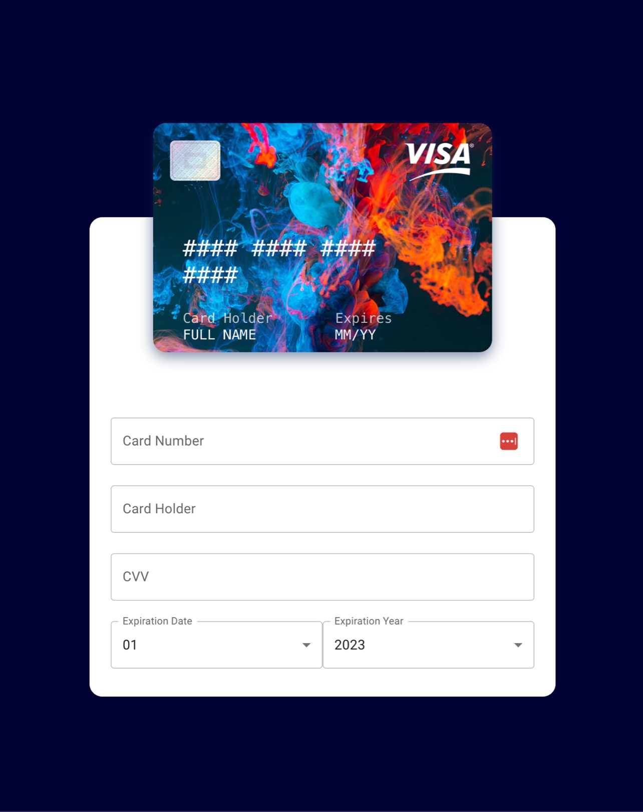

# Interactive Credit Card Form

A payment form with a live card preview that updates as you type, flips over to show the CVV, and recognizes the card network from the number.

**[Live demo →](https://elegant-trifle-0a151d.netlify.app/)**



## Features

- **Live preview:** the card number, holder name, and expiry date appear on the card as you type
- **Card flip:** the card turns over to show the back when you click into the CVV field
- **Card type detection:** Visa, Mastercard, American Express, Discover, UnionPay, Troy, and Diners Club, matched from the number's prefix
- **Click to edit:** clicking a field on the card focuses the matching form input
- **Random card art:** a different background image each time the page loads

## Built with

React · Material UI · Emotion

## Run locally

```sh
npm install
npm start
```

Then open http://localhost:3000.

> This is a UI demo. It doesn't submit or store card details anywhere.

---

Built by [Lexa Wong](https://www.lexawong.dev/)
